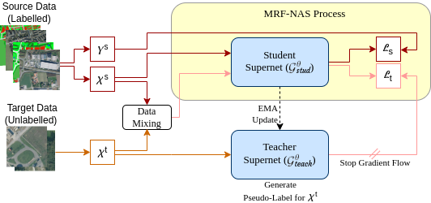

<h1 style="text-align: center;">Unsupervised Domain Adaptation Architecture Search with Self-Training for Land Cover Mapping</h1>

<p>We proposed a simple UDA-NAS framework to search for lightweight neural networks for land cover mapping tasks under domain shift. The framework integrates Markov random field neural architecture search into a self-training UDA scheme to search for efficient and effective networks under a limited computation budget. The paper is <a href="(https://arxiv.org/abs/2404.14704)">here</a>.</p>

<p>

</img>
</p>

### Requirements
The code depends on the packages in the `requirements.txt` file. 
Run `pip install -r requirements.txt` to install the packages.


### Overview
* Some packages are difficult to install and they are only used in data preprocessing, e.g. `osgeo`. You do not have to install all packages if you are not interested in some datasets. Please refer to `preprocess.py` and comment out the related code lines.

### Dataset
* Preprocess a dataset

```Shell
python preprocess.py func data_dir
```

For example

```Shell
python preprocess.py Land "/Users/whoami/datasets"
```

* The data hierachy before and after the preprocessing should be as follows. Please refer to `preprocess.py` for more details.

```
data_dir
|— land
|  |- train
|  |- resized
|- road
|  |- train
|  |- resized
|- building
|  |- spacenet
|  |  |- AOI_2_Vegas_Train
|  |  |- AOI_3_Paris_Train
|  |  |- AOI_4_Shanghai_Train
|  |  |- AOI_5_Khartoum_Train
|  |- train
|  |- resized
|- chaos
|  |- train
|  |  |- CT
|  |  |- MR
|  |- resized
|- promise
|  |- train
|  |  |- TrainingData_Part1
|  |  |- TrainingData_Part2
|  |  |- TrainingData_Part3
|  |- resized
```

### Usage
#### Learning
* Learning a MRF

```Shell 
python search.py
```

### Inference
* Inference over the learnt MRF

```Shell
# diverse 5-best inference
python inference.py --m 5 --lam 10
# diverse 10-best inference
python inference.py --m 10 --lam 20
```

### Training
* Train a found architecture

```Shell
# MRF-UNetV1
python train.py --choices "8,9,2,4,0,4,8,6,2,1,8,3,3,3,0,7,5,1,8,2,0,3,0,1,4,0"
# MRF-UNetV2
python train.py --choices "8,8,3,3,1,3,3,1,3,3,1,3,3,1,0,8,1,0,8,1,0,8,1,0,8,1"
```
The FLOPs and FPS (frames per second) were computed on 1024x1024 RGB input data. 
The inference speed was computed on a single NVIDIA Tesla P100 (DGX-1) with 16 GB
memory based on an average runtime of 300 iterations with 10 iterations warm-up

* If you just want to benchmark with MRF-UNets, copy `models/mrf_unet.py` and `models/ops.py` into your codebase and add the following statements into your training script

```Python
from models.mrf_unet import ChildNet
model = ChildNet(image_channels, num_classes, channel_step, choices)
```

### Citation
```BibTeX
@InProceedings{CliffUDA-NAS2024,
  title     = {Unsupervised Domain Adaptation Architecture Search with Self-Training for Land Cover Mapping},
  author    = {Clifford Broni-Bediako, Junshi Xia, Naoto Yokoya},
  booktitle = {Proceedings of the IEEE/CVF Conference on Computer Vision and Pattern Recognition Workshop (CVPRW)},
  year      = {2024}
}
```

### Acknowledgement
This code is heavily borrowed from MRF-UNet[https://github.com/zifuwanggg/MRF-UNets] and DAFormer[https://github.com/lhoyer/DAFormer?tab=readme-ov-file]. Thanks to the authors for making their code publically available.


### License
Under the MIT License, however, please refer to the licences of the MRF-UNet and DAFormer if you are using this code for commercial matters.